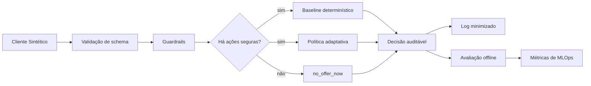
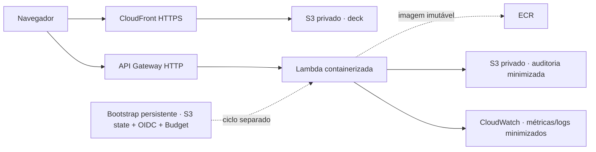

# Responsible Next Step Lab — MLOps para Empréstimos com Garantia

Laboratório demonstrável de **MLE/MLOps** para decidir o **Próximo Passo Responsável** em jornadas sintéticas de **Empréstimos com Garantia**.

O projeto simula uma plataforma de experimentação adaptativa para a persona **Lary**, CTO da unidade de negócio de Empréstimos com Garantia de um banco digital. A solução compara um baseline determinístico com uma política adaptativa, mantendo governança, explicabilidade, logs auditáveis e limites claros de uso.

> Este repositório **não** implementa um sistema bancário real, não aprova crédito, não calcula limite, não precifica taxa e não usa dados reais de clientes.

## Sumário

- [Objetivo](#objetivo)
- [Escopo do MVP](#escopo-do-mvp)
- [Arquitetura conceitual](#arquitetura-conceitual)
- [Arquitetura AWS executada e validada](#arquitetura-aws-executada-e-validada)
- [Dados](#dados)
- [Golden Set oficial](#golden-set-oficial)
- [MLOps e governança](#mlops-e-governança)
- [Estrutura do repositório](#estrutura-do-repositório)
- [Como começar](#como-começar)
- [Cloud shape local com LocalStack](#cloud-shape-local-com-localstack)
- [Bootstrap AWS persistente](#bootstrap-aws-persistente)
- [Resultados reproduzíveis](#resultados-reproduzíveis)
- [Mapa dos entregáveis oficiais](#mapa-dos-entregáveis-oficiais)
- [Roteiro da demo](#roteiro-da-demo)
- [Qualidade de engenharia](#qualidade-de-engenharia)
- [Roadmap](#roadmap)
- [Limitações e não-objetivos](#limitações-e-não-objetivos)

## Objetivo

Ajudar uma unidade de Empréstimos com Garantia a aumentar **Propostas Qualificadas Simuladas** por decisão, escolhendo um próximo passo responsável para um **Cliente Sintético**, considerando:

- tipo de garantia: veículo, imóvel ou investimentos;
- canal: SuperApp, especialista/agência ou fluxo híbrido;
- estágio da jornada;
- risco sintético;
- completude de contexto;
- guardrails;
- humano no loop;
- evolução futura de recompensas atrasadas (não provisionada no MVP);
- avaliação offline contra baseline.

A decisão não é “qual oferta vender”, mas sim qual ação de jornada tomar com segurança: simular, educar, solicitar documentação, encaminhar para especialista ou não ofertar naquele momento.

## Escopo do MVP

### Garantias no escopo

| Garantia | Papel no MVP |
| --- | --- |
| Veículo | Jornada digital simples, adequada ao SuperApp. |
| Imóvel | Jornada mais complexa, com maior chance de revisão humana. |
| Investimentos | Jornada para cliente sintético de maior relacionamento, com comunicação cuidadosa. |

### Fora do MVP inicial

- recebíveis sintéticos;
- pessoa jurídica;
- dados reais de clientes;
- aprovação, contratação, limite ou taxa real de crédito;
- operação produtiva regulada.

### Braços canônicos

- `simulate_vehicle_secured_loan`
- `simulate_home_equity`
- `simulate_investment_secured_loan`
- `educational_content_secured_credit`
- `request_documents`
- `route_to_specialist`
- `no_offer_now`

`no_offer_now` deve estar sempre disponível para impedir que a política seja forçada a simular ou vender quando não houver ação responsável.

## Arquitetura conceitual


```mermaid
flowchart LR
    A[Cliente Sintético] --> B[Validação de schema]
    B --> C[Guardrails]
    C --> D{Há ações seguras?}
    D -- não --> E[no_offer_now]
    D -- sim --> F[Baseline determinístico]
    D -- sim --> G[Política adaptativa]
    F --> H[Decisão auditável]
    G --> H
    E --> H
    H --> I[Log minimizado]
    H --> J[Avaliação offline]
    J --> K[Métricas de MLOps]
```

Contrato mínimo esperado de uma decisão:

```json
{
  "decision_id": "dec_001",
  "request_id": "req_001",
  "selected_action": "simulate_vehicle_secured_loan",
  "policy_version": "baseline_v0.1",
  "reason_codes": ["vehicle_collateral_anchor", "digital_channel_fit"],
  "guardrails_triggered": [],
  "requires_human_review": false,
  "audit_log_ref": "logs/decisions/2026-06-29.jsonl",
  "not_credit_approval": true,
  "requires_formal_credit_analysis": true
}
```

## Arquitetura AWS executada e validada

A arquitetura cloud efetivamente executada e validada foi **AWS**, em um ambiente temporário e sintético. O deploy histórico do #25 usou CloudFront → S3 privado para o deck e API Gateway HTTP → Lambda containerizada (imagem ECR) → S3 privado para auditoria, com CloudWatch minimizado, alarmes e dashboard. O smoke ponta a ponta passou para as três cenas e os dois modos de política; o teardown do #27 confirmou que os recursos temporários foram destruídos. Hoje não há URL AWS ativa.


```mermaid
flowchart LR
  B[Navegador] --> CF[CloudFront HTTPS]
  CF --> PS3[S3 privado · deck]
  B --> AG[API Gateway HTTP]
  AG --> L[Lambda containerizada]
  L -. imagem imutável .-> ECR[ECR]
  L --> AS3[S3 privado · auditoria minimizada]
  L --> CW[CloudWatch · métricas/logs minimizados]
  BS[Bootstrap persistente · S3 state + OIDC + Budget] -. ciclo separado .-> L
```

A integração local reproduziu apenas API Gateway REST → Lambda ZIP → S3 no LocalStack Community; não é prova da arquitetura AWS. Delayed Rewards não são uma capacidade provisionada: EventBridge → SQS → worker e um ledger de recompensa são apenas evolução futura, sujeita a nova decisão, implementação e validação.

### Equivalência Azure (conceitual, não validada)

| AWS executada | Equivalente Azure conceitual | Validação neste repositório |
| --- | --- | --- |
| CloudFront + S3 privado (deck) | Front Door + Blob Storage privado | Não implantado nem validado no Azure |
| API Gateway + Lambda/ECR | API Management + Azure Functions/Container Registry | Não implantado nem validado no Azure |
| S3 auditoria + CloudWatch | Blob Storage + Azure Monitor/Application Insights | Não implantado nem validado no Azure |
| OIDC GitHub + IAM | Federated Identity Credentials + RBAC | Não implantado nem validado no Azure |

Isto não é multicloud: AWS é a única arquitetura cloud executada/validada; Azure é somente uma equivalência conceitual. O diagrama completo, limites e proveniência estão em [`docs/architecture-aws.md`](docs/architecture-aws.md) e no [ADR-0002](docs/adr/0002-aws-como-arquitetura-executavel-do-mvp.md).

## Dados

A base pública inicial é **[Bank Marketing no Kaggle](https://www.kaggle.com/datasets/sushant097/bank-marketing-dataset-full)**, usada apenas como proxy público de resposta a campanha bancária. A fonte canônica é o [UCI Machine Learning Repository, dataset 222](https://archive.ics.uci.edu/dataset/222/bank).

Documentação principal:

- [`data/kaggle/README.md`](data/kaggle/README.md): fonte, licença, target, colunas, limitações, download e execução da preparação.
- [`notebooks/bank-marketing-eda.ipynb`](notebooks/bank-marketing-eda.ipynb): EDA executável e exportação dos artefatos preparados.
- [`docs/data/synthetic-schema.md`](docs/data/synthetic-schema.md): schema mínimo do Cliente Sintético e dados auxiliares.
- [`data/golden_set/evaluation_cases.jsonl`](data/golden_set/evaluation_cases.jsonl): cinco casos oficiais de avaliação do Baseline Determinístico.

Boas práticas adotadas:

- dados brutos ficam fora do versionamento sempre que possível;
- a coluna `duration` da Bank Marketing é removida/ignorada para decisão pré-interação por vazamento temporal;
- atributos sensíveis, identificadores pessoais, renda real, patrimônio real e regras comerciais privadas são proibidos;
- enriquecimento sintético deve ser reproduzível por semente aleatória;
- logs devem seguir minimização de dados.

## Golden Set oficial

Os cinco casos versionados em [`data/golden_set/evaluation_cases.jsonl`](data/golden_set/evaluation_cases.jsonl) verificam o contrato público do Baseline Determinístico. Eles não provam desempenho estatístico; funcionam como casos de aceitação de negócio, segurança e auditoria.

| Caso | Contexto resumido | Próximo passo esperado | Evidência responsável |
| --- | --- | --- | --- |
| `vehicle_digital` | Veículo, SuperApp, baixo risco e contexto completo | `simulate_vehicle_secured_loan` | Autosserviço sem revisão humana. |
| `home_complex` | Imóvel complexo e baixa confiança | `route_to_specialist` | Humano no Loop obrigatório. |
| `incomplete_context` | Detalhes recuperáveis da garantia ausentes | `request_documents` | Não simula antes de completar o contexto. |
| `education_first` | Início da jornada e baixa clareza | `educational_content_secured_credit` | Explica antes de simular. |
| `adversarial_ineligible` | Risco crítico e contexto adversarial | `no_offer_now` | Guardrail bloqueia exposição indevida. |

Estrutura esperada de dados:

```text
data/
  kaggle/
    README.md
    raw/                 # não versionar dados brutos grandes
    processed/           # dados preparados sem vazamento temporal
  golden_set/
    evaluation_cases.jsonl
```

## MLOps e governança

### Uso pretendido e autoridade da decisão

Este laboratório serve para comparar, offline, um Baseline Determinístico e uma Política Adaptativa na escolha do **Próximo Passo Responsável** para Clientes Sintéticos. Seu uso pretendido é demonstrar experimentação, rastreabilidade, Guardrails e explicabilidade para Lary; não é decidir crédito real nem comprovar impacto causal.

As etapas da jornada não são intercambiáveis:

| Etapa | Significado neste MVP |
| --- | --- |
| **Próximo Passo Responsável** | Recomendação de jornada entre Braços seguros; não é recomendação nem decisão de concessão de crédito. |
| **Simulação** | Exploração de uma possibilidade sintética, sem taxa, limite ou compromisso real. |
| **Proposta Qualificada Simulada** | Simulação concluída com dados mínimos ou documentação sintética para pré-análise; é uma métrica, não uma decisão de crédito. |
| **Aprovação** | Decisão formal de crédito, fora do escopo e dependente de processos reais de risco e compliance. |
| **Contratação** | Formalização posterior à aprovação, também fora do escopo. |

São usos fora de escopo: aprovação ou contratação automática; cálculo de limite ou taxa; decisão de elegibilidade real; recomendação de investimento; uso por banco ou cliente real; integração com core bancário; substituição de risco, jurídico ou compliance; e operação em produção regulada. LLM/RAG pode explicar artefatos existentes, mas não escolhe Braços nem altera Guardrails.

### Limitações e riscos conhecidos

- **Bank Marketing é apenas proxy:** descreve resposta a campanha de depósito a prazo, não jornadas de Empréstimos com Garantia. Seus campos não comprovam intenção, risco, elegibilidade ou resultado de crédito.
- **Recompensas são simuladas:** probabilidades e contrafactuais foram definidos pelo laboratório. Uplift, regret e exposição medem o comportamento nesse simulador, não efeito causal ou desempenho futuro.
- **Cobertura limitada:** o Golden Set tem cinco casos e não representa toda a diversidade operacional, adversarial ou de canais.
- **Fairness limitada:** segmentos são sintéticos e não sensíveis. A análise de exposição pode revelar desequilíbrios no simulador, mas não demonstra equidade para grupos protegidos nem autoriza inferi-los por proxies.
- **Riscos residuais:** proxy inadequado, vazamento temporal, exploração excessiva, repetição de contato, recompensa atrasada ou censurada, Reason Code insuficiente e uso indevido da saída como oferta ou aprovação.

Por essas limitações, nenhum resultado autoriza promoção para produção bancária ou comunicação de concessão de crédito.

### Dados, minimização e LGPD simulada

O projeto adota princípios de finalidade, necessidade, minimização, transparência e rastreabilidade apenas como **postura simulada de LGPD**; não declara conformidade jurídica. São proibidos dados reais de clientes, CPF, nome, e-mail, telefone, endereço, identificadores pessoais, renda, saldo ou patrimônio reais, dados reais de garantias, atributos sensíveis, geolocalização granular e regras comerciais privadas. Idade, estado civil, escolaridade e ocupação não são features de decisão; `duration` é bloqueada por vazamento temporal.

A entrada deve conter somente os campos sintéticos permitidos em [`docs/data/synthetic-schema.md`](docs/data/synthetic-schema.md). O log persiste contexto minimizado, IDs sintéticos, versão da política, Braço selecionado e elegível, Reason Codes, Guardrails e indicação de revisão humana; campos proibidos não devem ser retidos.

A retenção é local e demonstrativa: `logs/`, dados brutos, bancos e artefatos do MLflow ficam fora do Git. Apenas relatório, política e manifesto derivados aprovados em `artifacts/official-experiment/` são versionados, sem registros por cliente. Não existe descarte automático nem política corporativa de retenção. O operador da demo deve usar diretório temporário e excluir os demais artefatos ao encerrar a avaliação; qualquer retenção além da sessão exige finalidade, prazo e responsável definidos antes da coleta.

### Guardrails, Humano no Loop e auditoria

Guardrails são aplicados antes de qualquer política, e a Política Adaptativa só pode escolher entre Braços elegíveis. Contexto crítico, dado proibido, `duration`, garantia/canal inválido, contexto obrigatório ausente ou repetição excessiva restringem a decisão a `no_offer_now`. Esse comportamento reduz risco, mas não substitui validação humana ou controles bancários reais.

`requires_human_review = true` é exigido para encaminhamento a especialista e para cenários como garantia de imóvel em simulação/documentação, alta complexidade, alto risco sintético, baixa confiança ou `human_review_hint`. A revisão humana interpreta o próximo passo e pode interromper a jornada; ela não transforma a saída em Aprovação. Casos bloqueados com `no_offer_now` não são aprovados silenciosamente e podem ser analisados fora do decisor quando houver suspeita de falha do Guardrail.

Cada decisão registra `decision_id`, `request_id`, `policy_version`, `selected_action`, `eligible_actions`, `reason_codes`, `guardrails_triggered`, `requires_human_review`, referência de configuração e flags explícitas de não aprovação/contratação. `audit_log_ref` permite localizar o JSONL minimizado. Esses logs são evidência técnica da demo, não trilha de auditoria regulatória completa.

### Fairness, aprovação, pausa e rollback

A revisão mínima de fairness compara por `synthetic_segment` a exposição por Braço, sucesso sintético, acionamento de Guardrails e revisão humana. Não se devem criar ou inferir segmentos protegidos. Diferença sem justificativa, ausência de cobertura, concentração inesperada de exposição ou benefício aparente obtido à custa de Guardrails impede promoção até investigação humana; o MVP não define limiar estatístico de produção.

O ciclo demonstrativo é:

1. versionar schema, catálogo, política, dados e sementes;
2. validar testes e Golden Set;
3. comparar múltiplas sementes contra o baseline e revisar uplift, regret, exploração, exposição, Guardrails e fairness disponível;
4. registrar limitações e obter aprovação humana explícita de produto e risco/compliance simulado;
5. somente então usar o artefato na demo, sem aprendizado online ou promoção automática.

A política deve ser pausada diante de quebra de contrato, Guardrail contornado, dado proibido, log incompleto, exposição injustificada, regressão no Golden Set ou comportamento adversarial inesperado. O rollback demonstrável consiste em retirar o `policy.json` adaptativo e executar novamente a CLI no Baseline Determinístico padrão; artefatos incompatíveis falham explicitamente, sem fallback silencioso. A causa, versão afetada, decisão humana e versão restaurada devem ser registradas antes de retomar a avaliação.

Métricas atuais incluem uplift sintético, recompensa e regret acumulados, taxa de exploração, exposição por Braço, Guardrails e cobertura de logs. Fairness extensa, delayed rewards complexos, monitoramento de produção e processo regulatório de promoção permanecem fora do MVP.

## Estrutura do repositório

```text
.
├── CONTEXT.md                         # Linguagem canônica do domínio
├── AGENTS.md                          # Instruções para agentes neste repositório
├── data/
│   └── kaggle/
│       └── README.md                  # Documentação da base pública
├── docs/
│   ├── adr/                           # Decisões arquiteturais
│   ├── agents/                        # Operação com issues e agentes
│   ├── data/                          # Schemas e contratos de dados
│   ├── decisions/                     # Decisões de produto/domínio
│   ├── product/                       # PRD, MVP e catálogo de braços
│   └── research/                      # Pesquisa de mercado e domínio
└── personas/
    └── lary-cto-bu-loan/              # Persona principal do projeto
```

Documentos essenciais:

- [`docs/product/prd-proximo-passo-responsavel.md`](docs/product/prd-proximo-passo-responsavel.md)
- [`docs/product/mvp-lary.md`](docs/product/mvp-lary.md)
- [`docs/product/offer-arms.md`](docs/product/offer-arms.md)
- [`docs/decisions/003-checklist-planejamento-mvp-lary.md`](docs/decisions/003-checklist-planejamento-mvp-lary.md)
- [`personas/lary-cto-bu-loan/SOUL.md`](personas/lary-cto-bu-loan/SOUL.md)

## Como começar

### Pré-requisitos atuais

- Python 3.10+;
- MLflow, instalado automaticamente com o pacote;
- opcional: ambiente virtual local;
- Kaggle CLI ou download direto da UCI para dados públicos, apenas quando os dados forem necessários.

A primeira interface executável é uma CLI Python. Ela recebe um **Cliente Sintético** em JSON, aplica Guardrails e grava log auditável minimizado. Sem opções adicionais, usa o Baseline Determinístico retrocompatível; também aceita explicitamente uma Política Adaptativa gerada pelo experimento. O MLflow é usado apenas pelo comando de experimento.

### Executar a API de Demonstração

A superfície HTTP aceita somente os três cenários sintéticos oficiais (`vehicle_simple`, `home_complex` e `guardrail_sensitive`) e a escolha explícita entre `baseline` e `adaptive`. Instale o pacote e inicie localmente:

```bash
python -m pip install -e '.[test]'
uvicorn responsible_next_step.api:app --host 127.0.0.1 --port 8000
```

Em outro terminal, execute uma decisão:

```bash
curl --fail-with-body http://127.0.0.1:8000/v1/decisions \
  --header 'Content-Type: application/json' \
  --data '{"scenario_id":"vehicle_simple","policy_mode":"baseline"}'
```

`GET /health` informa somente saúde técnica e `GET /ready` informa prontidão, sem expor cenários, política ou auditoria. `ADAPTIVE_ENABLED=false` pausa explicitamente apenas a Política Adaptativa, sem fallback silencioso; `AUDIT_LOG_DIR` configura a persistência local minimizada. Falha de auditoria fecha a requisição com erro de serviço e sem decisão válida.

A mesma aplicação usa `responsible_next_step.api:handler` como adaptação Mangum para Lambda; Uvicorn continua sendo o caminho de desenvolvimento HTTP direto.

Esta é uma **API de Demonstração**, não uma API bancária genérica nem uma superfície pronta para produção regulada. Ela não recebe contexto arbitrário ou dados pessoais.

## Cloud shape local com LocalStack

O fluxo local isolado usa state Terraform no disco, credenciais descartáveis e endpoint overrides somente no provider LocalStack; ele não altera perfil ou recursos AWS reais. Para contornar a limitação conhecida do ECR na edição Community, ele empacota a mesma aplicação FastAPI/Mangum e suas dependências em um ZIP Python 3.12 local, aplica API Gateway REST/Lambda/S3 e executa o smoke HTTP + objeto de auditoria S3:

```bash
python -m pip install -e '.[test]'
./scripts/local-demo.sh start
```

Ao terminar, destrua o ambiente e o volume LocalStack:

```bash
./scripts/local-demo.sh cleanup
```

O ZIP é somente o transporte local suportado para esta integração; não demonstra paridade com Lambda por imagem/ECR da AWS. O transporte de container/ECR real permanece fora deste escopo. Detalhes de pré-requisitos, validação Terraform e limites explícitos de paridade estão em [`docs/localstack.md`](docs/localstack.md). CloudFront, OIDC, IAM de conta real, observabilidade/alarmes e outros comportamentos não confiáveis na edição free não são simulados como prova: exigem testes de integração AWS futuros.

## Bootstrap AWS persistente

O bootstrap separado foi aplicado e permanece como fundação persistente: backend S3 privado/versionado com lockfile nativo, identities GitHub OIDC, roles revisadas, permissions boundary e AWS Budget. Ele não cria nem compartilha recursos da demo temporária. A demo AWS foi destruída após a validação; bootstrap e Budget persistem. Pré-requisitos de MFA root, ausência de Access Keys root, IAM Identity Center/SSO, migração/recovery de state e handoff de privilégio mínimo estão em [`docs/aws-bootstrap.md`](docs/aws-bootstrap.md).

## Integração, aprovação e ciclo de vida AWS

- `develop` é a branch de integração; o PR `develop` → `main` é a superfície de aprovação humana auditável.
- O PR executa qualidade e Terraform plan não mutante. A proteção de `main` exige os checks `quality / software, evidence, deck and Terraform` e `plan / non-mutating demo Terraform plan`, além de branch atualizada.
- O merge manual do PR gera um push em `main`, que executa automaticamente qualidade, plan e deploy. PRs e pushes em `develop` nunca fazem deploy.
- O deploy usa OIDC, `environment: demo`, policy de deployment somente para `main`, concorrência compartilhada com teardown e `LOW_QUOTA_MODE=true` enquanto a conta permanecer limitada. Não há segunda aprovação de environment após o merge.
- O teardown continua manual com confirmação exata `DESTROY_DEMO`; o schedule só executa a limpeza de recursos expirados. Deploy e destroy não concorrem pelo state.

A arquitetura, os gates e as instruções operacionais estão em [`docs/demo/runbook-operador.md`](docs/demo/runbook-operador.md) e [`docs/aws-bootstrap.md`](docs/aws-bootstrap.md).

### Executar a primeira decisão demonstrável

Sem instalar o pacote:

```bash
PYTHONPATH=src python -m responsible_next_step decide \
  --input examples/synthetic-customers/vehicle-simple.json \
  --audit-log-dir logs/decisions \
  --pretty
```

Opcionalmente, instalar em modo editável para usar o comando console:

```bash
python -m pip install -e .
responsible-next-step decide \
  --input examples/synthetic-customers/vehicle-simple.json \
  --audit-log-dir logs/decisions \
  --pretty
```

Documentação detalhada das cenas demonstráveis:

- [`docs/demo/cena-1-veiculo-digital.md`](docs/demo/cena-1-veiculo-digital.md);
- [`docs/demo/cena-2-imovel-complexo.md`](docs/demo/cena-2-imovel-complexo.md).

Exemplos adicionais:

```bash
PYTHONPATH=src python -m responsible_next_step decide \
  --input examples/synthetic-customers/home-complex.json \
  --audit-log-dir logs/decisions \
  --pretty

PYTHONPATH=src python -m responsible_next_step decide \
  --input examples/synthetic-customers/guardrail-sensitive.json \
  --audit-log-dir logs/decisions \
  --pretty
```

A saída inclui `decision_id`, `request_id`, `selected_action`, `policy_version`, `reason_codes`, `requires_human_review`, `guardrails_triggered`, `audit_log_ref` e flags explícitas de que a decisão **não é aprovação**, **não é contratação**, **não define taxa** e **não define limite real**.

### Avaliar o Golden Set oficial

O comando abaixo executa offline os cinco casos versionados pelo mesmo seam público do Baseline Determinístico:

```bash
PYTHONPATH=src python -m responsible_next_step evaluate-golden-set \
  --input data/golden_set/evaluation_cases.jsonl \
  --audit-log-dir logs/golden-set \
  --pretty
```

O relatório estruturado mostra pass/fail por caso, resumo agregado e cobertura observada de Braços, Guardrails, Reason Codes e logs auditáveis. Divergências do comportamento esperado, falhas do contrato de saída ou ausência de log reprovam o caso; a CLI retorna status `1` quando algum caso falha e status `2` quando o Golden Set não pode ser validado ou lido.

### Decidir com a Política Adaptativa

Após gerar `policy.json` pelo comando `experiment`, use a mesma interface pública:

```bash
PYTHONPATH=src python -m responsible_next_step decide \
  --input examples/synthetic-customers/vehicle-simple.json \
  --policy adaptive \
  --policy-artifact artifacts/experiment/policy.json \
  --audit-log-dir logs/decisions \
  --pretty
```

A CLI valida schema, versão da política, catálogo de Braços, definição de contexto, priors, posteriors, seed e declaração obrigatória de Guardrails. Os Guardrails são aplicados antes da amostragem Thompson Sampling; portanto, a política recebe somente os Braços já considerados elegíveis e seguros. Contextos críticos continuam restritos a `no_offer_now`.

O modo adaptativo adota **falha explícita**, sem fallback silencioso: artefato ausente, malformado ou incompatível encerra o comando com status `2` e não grava decisão. Para fallback operacional seguro, execute novamente sem `--policy adaptive`; o padrão documentado permanece o Baseline Determinístico. Informar `--policy-artifact` no modo baseline também é rejeitado para impedir que uma configuração seja ignorada silenciosamente.

### Baixar a base pública

Opção UCI:

```bash
mkdir -p data/kaggle/raw/bank-marketing-download \
  data/kaggle/raw/bank-marketing
curl -L "https://archive.ics.uci.edu/static/public/222/bank+marketing.zip" \
  -o data/kaggle/raw/bank-marketing.zip
unzip -o data/kaggle/raw/bank-marketing.zip bank.zip \
  -d data/kaggle/raw/bank-marketing-download
unzip -jo data/kaggle/raw/bank-marketing-download/bank.zip bank-full.csv \
  -d data/kaggle/raw/bank-marketing
```

Opção Kaggle CLI:

```bash
mkdir -p data/kaggle/raw/bank-marketing
kaggle datasets download \
  -d sushant097/bank-marketing-dataset-full \
  -p data/kaggle/raw/bank-marketing \
  --unzip
```

O link direto e as instruções completas estão em [`data/kaggle/README.md`](data/kaggle/README.md). Com `bank-full.csv` no caminho documentado, execute:

```bash
python -m pip install -e .
python -m pip install jupyter
jupyter nbconvert --to notebook --execute \
  notebooks/bank-marketing-eda.ipynb \
  --output bank-marketing-eda.executed.ipynb
```

A preparação pública também pode ser reutilizada em Python:

```python
from responsible_next_step import prepare_bank_marketing

prepared = prepare_bank_marketing(
    "data/kaggle/raw/bank-marketing/bank-full.csv",
    seed=20260629,
)
```

`prepared.features` exclui `duration` e as categorias proibidas; `prepared.target` contém o target binário e `prepared.metadata` registra linhagem e reprodutibilidade.

### Comparar baseline experimental e Política Adaptativa

O experimento offline usa a mesma preparação pública, um simulador de recompensa binária transparente, baseline fixo e Thompson Sampling contextual. Guardrails restringem os Braços antes da seleção. Execute com múltiplas seeds:

```bash
PYTHONPATH=src python -m responsible_next_step experiment \
  --input data/kaggle/raw/bank-marketing/bank-full.csv \
  --output-dir artifacts/official-experiment \
  --seeds 11,29,47,71,97 \
  --horizon 45211 \
  --tracking-uri sqlite:///mlflow.db \
  --omit-evaluation-decisions \
  --pretty
```

A execução oficial percorre as **45.211 linhas** em cada uma das cinco seeds e publica somente [`report.json`](artifacts/official-experiment/report.json), [`policy.json`](artifacts/official-experiment/policy.json) e [`provenance.json`](artifacts/official-experiment/provenance.json). O manifesto registra URL e SHA-256 da fonte, preparação sem `duration`, configuração, seeds, horizonte, revisão de cobertura e hashes dos dois artefatos derivados. A base bruta, o tracking MLflow e logs volumosos permanecem fora do Git. Remova `--omit-evaluation-decisions` em execuções locais quando o log auditável por decisão for necessário.

Para abrir a interface local no diretório raiz do repositório:

```bash
mlflow ui --backend-store-uri sqlite:///mlflow.db --port 5000
```

Depois, acesse <http://127.0.0.1:5000>. `mlflow.db`, `mlartifacts/`, `mlruns/`, dados brutos e logs locais estão excluídos do Git. A única exceção é o conjunto derivado aprovado em `artifacts/official-experiment/`. Para isolar outra execução, informe uma URI SQLite diferente, por exemplo `sqlite:////tmp/responsible-next-step/mlflow.db`.

O relatório agrega recompensa sintética de avanço qualificado, uplift, regret, exploração e exposição por Braço sem selecionar apenas uma seed favorável. Essa recompensa não é clique nem é contabilizada como Proposta Qualificada Simulada. Cada decisão avaliada registra `policy_version`, conjunto elegível e Guardrails.

A Bank Marketing não contém recompensas contrafactuais por Braço. Portanto, os resultados são **simulados, offline e não causais**; não demonstram eficácia em crédito real. Contexto, coeficientes, priors e limitações estão documentados em [`docs/experiments/offline-bandit.md`](docs/experiments/offline-bandit.md).

## Resultados reproduzíveis

A evidência oficial versionada foi gerada da Bank Marketing completa, com SHA-256 da fonte `d1513ec63b385506f7cfce9f2c5caa9fe99e7ba4e8c3fa264b3aaf0f849ed32d`, seeds `11,29,47,71,97` e horizonte de 45.211 decisões por seed. Os números para gráficos estão no [`report.json`](artifacts/official-experiment/report.json); a revisão encontrou os nove contextos sintéticos esperados e exposição adaptativa em todos os sete Braços. Valide schemas, cobertura e hashes sem rede nem base bruta:

```bash
PYTHONPATH=src python -m responsible_next_step validate-experiment-artifacts \
  --artifact-dir artifacts/official-experiment \
  --pretty
```

Esses resultados medem uma **recompensa binária simulada de avanço qualificado** sob coeficientes definidos pelo laboratório. São sintéticos, offline e não causais: não são taxa de conversão observada, Proposta Qualificada Simulada, delayed reward real ou previsão de desempenho bancário. A fixture de quatro registros permanece apenas para testes rápidos e não é evidência da apresentação.

## Mapa dos entregáveis oficiais

O PDF oficial simplificado organiza a entrega nas etapas 0–8. Esta tabela aponta a evidência central e o comando de validação sem depender de explicação oral.

| Etapa | Evidência no repositório | Validação principal |
| --- | --- | --- |
| 0 — Organização | `README.md`, `pyproject.toml`, `.gitignore`, histórico incremental | `python -m pip install -e . && responsible-next-step --help` |
| 1 — Kaggle e EDA | link Kaggle acima, `data/kaggle/README.md`, notebook reutilizando o módulo público | `jupyter nbconvert --to notebook --execute notebooks/bank-marketing-eda.ipynb --output bank-marketing-eda.executed.ipynb` |
| 2 — Preparação | `prepare_bank_marketing`, schema e linhagem sem `duration` | `python -m pytest tests/test_bank_marketing_preparation.py tests/test_bank_marketing_notebook.py` |
| 3 — Baseline e adaptativo | baseline fixo, Thompson Sampling, priors e comparação multi-seed | `PYTHONPATH=src python -m responsible_next_step experiment --input tests/fixtures/bank-full-small.csv --output-dir /tmp/rns-experiment --seeds 11,29,47 --horizon 400 --tracking-uri sqlite:////tmp/rns-mlflow.db --pretty` |
| 4 — Avaliação | métricas e Golden Set de cinco casos resumido acima | `PYTHONPATH=src python -m responsible_next_step evaluate-golden-set --input data/golden_set/evaluation_cases.jsonl --audit-log-dir /tmp/rns-golden --pretty` |
| 5 — Interface | CLI de decisão, Reason Codes, `policy_version`, Guardrails e log | `PYTHONPATH=src python -m responsible_next_step decide --input examples/synthetic-customers/vehicle-simple.json --audit-log-dir /tmp/rns-decisions --pretty` |
| 6 — Nuvem | arquitetura AWS executada, LocalStack e equivalência Azure conceitual | Revisão de [`docs/architecture-aws.md`](docs/architecture-aws.md) e `terraform validate` |
| 7 — MLOps | MLflow local, geração de `report.json`/`policy.json` e rollback documentado | `mlflow ui --backend-store-uri sqlite:////tmp/rns-mlflow.db --port 5000` |
| 8 — Demo Day | roteiro de até cinco minutos e contingência versionados | Revisão de [`docs/demo/roteiro-pitch-5-minutos.md`](docs/demo/roteiro-pitch-5-minutos.md) |

## Apresentação offline

O deck Reveal.js em português fica em [`presentation/`](presentation/). O fluxo principal tem 11 slides para **4min50s**, speaker notes (`S`), três gráficos Plotly derivados automaticamente do relatório oficial, dois diagramas Mermaid e cinco slides de apêndice. O build 16:9 empacota Reveal.js, Plotly, Mermaid, estilos e os três artefatos oficiais; nenhum recurso de runtime depende de CDN.

```bash
cd presentation
npm ci
npx playwright install chromium  # somente na primeira execução
npm test
npm run build
```

Abra `presentation/dist/index.html` em Chrome/Edge atual, inclusive sem rede. `npm test` valida o build e o contrato do relatório, abre o artefato final por `file://` em Chromium, renderiza gráficos/diagramas, navega offline e rejeita requisições HTTP(S). `dist/`, `node_modules/` e resultados do Playwright não são versionados.

## Roteiro da demo

O roteiro final, com fluxo principal de **até cinco minutos**, falas, comandos, três cenas responsáveis e plano de contingência está em [`docs/demo/roteiro-pitch-5-minutos.md`](docs/demo/roteiro-pitch-5-minutos.md). O runbook reproduzível para outro operador está em [`docs/demo/runbook-operador.md`](docs/demo/runbook-operador.md). As saídas resumidas previamente salvas ficam em [`docs/demo/saidas-contingencia.md`](docs/demo/saidas-contingencia.md). O aceite final, commits e hashes estão em [`docs/demo/acceptance-final.md`](docs/demo/acceptance-final.md). O relatório, a política e o manifesto oficiais da base completa estão versionados em `artifacts/official-experiment/`; dados brutos e logs de execução não estão.

## Qualidade de engenharia

Padrões esperados para implementação futura:

### Software engineering

- contratos públicos estáveis para CLI/API;
- módulos pequenos, com fronteiras claras entre dados, política, guardrails, avaliação e interface;
- testes de aceitação no nível do contrato de decisão;
- versionamento semântico de políticas e schemas;
- logs estruturados e minimizados;
- configuração por ambiente, sem segredos no repositório.

### Data engineering

- separação entre `raw`, `processed` e dados sintéticos;
- validação explícita de schema;
- bloqueio de colunas com vazamento temporal;
- linhagem de dados e semente de geração sintética;
- documentação de limitações da fonte pública;
- datasets derivados reproduzíveis por comando.

### ML/MLOps

- baseline determinístico obrigatório antes da política adaptativa;
- avaliação offline reproduzível;
- golden set versionado;
- métricas além de clique ou conversão superficial;
- controle de exploração apenas entre braços elegíveis e seguros;
- aprovação humana, pausa e rollback antes de qualquer promoção de política.

## Roadmap

Estado atual:

- [x] persona Lary documentada;
- [x] MVP narrativo documentado;
- [x] catálogo de braços documentado;
- [x] base pública documentada;
- [x] schema mínimo do Cliente Sintético documentado;
- [x] preparação reproduzível da Bank Marketing sem vazamento temporal;
- [x] notebook de EDA e tratamento executável.

Próximas entregas recomendadas:

- [x] criar `data/golden_set/evaluation_cases.jsonl` e avaliação offline dos cinco casos oficiais;
- [x] implementar baseline determinístico inicial;
- [x] implementar CLI de decisão;
- [x] criar testes de aceitação do contrato da CLI;
- [x] implementar avaliação offline reproduzível contra baseline experimental;
- [x] implementar Thompson Sampling contextual simplificado;
- [x] registrar a comparação adaptativa em MLflow local;
- [x] consolidar no README a governança mínima, a postura simulada de LGPD, o Humano no Loop e o rollback da demo;
- [ ] evoluir Model Card, System Card e plano LGPD como artefatos separados, sem bloquear o MVP demonstrável;
- [x] documentar arquitetura AWS executada, equivalência Azure conceitual e limites de validação;
- [x] criar roteiro de demo de até cinco minutos para Lary.

## Limitações e não-objetivos

Este projeto não deve ser interpretado como:

- motor de aprovação automática de crédito;
- política real de concessão;
- precificador de taxa ou limite;
- recomendador de investimento;
- substituto de risco, jurídico ou compliance;
- integração com core bancário real;
- sistema pronto para produção regulada.

Todo resultado é sintético, demonstrativo e voltado a aprendizado, governança e avaliação offline.

## Licença e dados de terceiros

A licença do código deste repositório deve ser definida pelo mantenedor antes de qualquer distribuição ampla.

A base Bank Marketing pertence à sua fonte original e deve ser usada conforme a licença e termos indicados pela UCI/Kaggle. Consulte [`data/kaggle/README.md`](data/kaggle/README.md) antes de baixar, processar ou redistribuir dados.
