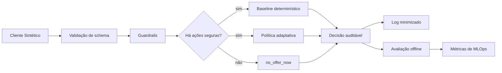

# Responsible Next Step Lab — MLOps para Empréstimos com Garantia

Plataforma demonstrável de **MLE/MLOps e IA generativa** para decidir o **Próximo Passo Responsável** em jornadas sintéticas de **Empréstimos com Garantia**.

O projeto simula uma plataforma de experimentação adaptativa para a persona **Lary**, CTO da unidade de negócio de Empréstimos com Garantia de um banco digital. A solução compara um baseline determinístico com uma política adaptativa, mantendo governança, explicabilidade, logs auditáveis e limites claros de uso.

> Este repositório **não** implementa um sistema bancário real, não aprova crédito, não calcula limite, não precifica taxa e não usa dados reais de clientes.

## Sumário

- [Objetivo](#objetivo)
- [Escopo do MVP](#escopo-do-mvp)
- [Arquitetura conceitual](#arquitetura-conceitual)
- [Dados](#dados)
- [MLOps e governança](#mlops-e-governança)
- [Estrutura do repositório](#estrutura-do-repositório)
- [Como começar](#como-começar)
- [Qualidade de engenharia](#qualidade-de-engenharia)
- [Roadmap](#roadmap)
- [Limitações e não-objetivos](#limitações-e-não-objetivos)

## Objetivo

Ajudar uma unidade de Empréstimos com Garantia a aumentar **Propostas Qualificadas Simuladas** por decisão, escolhendo um próximo passo responsável para um **Cliente Sintético**, considerando:

- tipo de garantia: veículo, imóvel ou investimentos;
- canal: SuperApp, especialista/agência ou fluxo híbrido;
- estágio da jornada;
- risco sintético;
- completude de contexto;
- guardrails;
- humano no loop;
- delayed rewards;
- avaliação offline contra baseline.

A decisão não é “qual oferta vender”, mas sim qual ação de jornada tomar com segurança: simular, educar, solicitar documentação, encaminhar para especialista ou não ofertar naquele momento.

## Escopo do MVP

### Garantias no escopo

| Garantia | Papel no MVP |
| --- | --- |
| Veículo | Jornada digital simples, adequada ao SuperApp. |
| Imóvel | Jornada mais complexa, com maior chance de revisão humana. |
| Investimentos | Jornada para cliente sintético de maior relacionamento, com comunicação cuidadosa. |

### Fora do MVP inicial

- recebíveis sintéticos;
- pessoa jurídica;
- dados reais de clientes;
- aprovação, contratação, limite ou taxa real de crédito;
- operação produtiva regulada.

### Braços canônicos

- `simulate_vehicle_secured_loan`
- `simulate_home_equity`
- `simulate_investment_secured_loan`
- `educational_content_secured_credit`
- `request_documents`
- `route_to_specialist`
- `no_offer_now`

`no_offer_now` deve estar sempre disponível para impedir que a política seja forçada a simular ou vender quando não houver ação responsável.

## Arquitetura conceitual


```mermaid
flowchart LR
    A[Cliente Sintético] --> B[Validação de schema]
    B --> C[Guardrails]
    C --> D{Há ações seguras?}
    D -- não --> E[no_offer_now]
    D -- sim --> F[Baseline determinístico]
    D -- sim --> G[Política adaptativa]
    F --> H[Decisão auditável]
    G --> H
    E --> H
    H --> I[Log minimizado]
    H --> J[Avaliação offline]
    J --> K[Métricas de MLOps]
```

Contrato mínimo esperado de uma decisão:

```json
{
  "decision_id": "dec_001",
  "request_id": "req_001",
  "selected_action": "simulate_vehicle_secured_loan",
  "policy_version": "baseline_v0.1",
  "reason_codes": ["vehicle_collateral_anchor", "digital_channel_fit"],
  "guardrails_triggered": [],
  "requires_human_review": false,
  "audit_log_ref": "logs/decisions/2026-06-29.jsonl",
  "not_credit_approval": true,
  "requires_formal_credit_analysis": true
}
```

## Dados

A base pública inicial é **Bank Marketing**, usada apenas como proxy público de resposta a campanha bancária.

Documentação principal:

- [`data/kaggle/README.md`](data/kaggle/README.md): fonte, licença, target, colunas, limitações, download e execução da preparação.
- [`notebooks/bank-marketing-eda.ipynb`](notebooks/bank-marketing-eda.ipynb): EDA executável e exportação dos artefatos preparados.
- [`docs/data/synthetic-schema.md`](docs/data/synthetic-schema.md): schema mínimo do Cliente Sintético e dados auxiliares.
- [`data/golden_set/evaluation_cases.jsonl`](data/golden_set/evaluation_cases.jsonl): cinco casos oficiais de avaliação do Baseline Determinístico.

Boas práticas adotadas:

- dados brutos ficam fora do versionamento sempre que possível;
- a coluna `duration` da Bank Marketing é removida/ignorada para decisão pré-interação por vazamento temporal;
- atributos sensíveis, identificadores pessoais, renda real, patrimônio real e regras comerciais privadas são proibidos;
- enriquecimento sintético deve ser reproduzível por semente aleatória;
- logs devem seguir minimização de dados.

Estrutura esperada de dados:

```text
data/
  kaggle/
    README.md
    raw/                 # não versionar dados brutos grandes
    processed/           # dados preparados sem vazamento temporal
  golden_set/
    evaluation_cases.jsonl
```

## MLOps e governança

O projeto deve tratar políticas de decisão como artefatos versionados.

Fluxo alvo:

1. definir ou atualizar catálogo de braços;
2. validar schema e guardrails;
3. rodar baseline determinístico;
4. rodar política adaptativa em avaliação offline;
5. comparar métricas contra baseline;
6. revisar fairness, exploração, regret e guardrails;
7. exigir aprovação humana antes de promoção;
8. monitorar decisões, recompensas e drift;
9. permitir pausa ou rollback.

Métricas esperadas:

- uplift contra baseline;
- recompensa acumulada;
- regret acumulado;
- taxa de exploração;
- conversão qualificada simulada;
- proposta qualificada simulada;
- exposição por braço;
- fairness por segmento sintético;
- taxa de guardrails acionados;
- cobertura de logs auditáveis.

LLM/RAG pode apoiar explicação, consulta documental e governança, mas **não** escolhe braço, não aprova crédito e não substitui guardrails ou reason codes.

## Estrutura do repositório

```text
.
├── CONTEXT.md                         # Linguagem canônica do domínio
├── AGENTS.md                          # Instruções para agentes neste repositório
├── data/
│   └── kaggle/
│       └── README.md                  # Documentação da base pública
├── docs/
│   ├── adr/                           # Decisões arquiteturais
│   ├── agents/                        # Operação com issues e agentes
│   ├── data/                          # Schemas e contratos de dados
│   ├── decisions/                     # Decisões de produto/domínio
│   ├── product/                       # PRD, MVP e catálogo de braços
│   └── research/                      # Pesquisa de mercado e domínio
└── personas/
    └── lary-cto-bu-loan/              # Persona principal do projeto
```

Documentos essenciais:

- [`docs/product/prd-proximo-passo-responsavel.md`](docs/product/prd-proximo-passo-responsavel.md)
- [`docs/product/mvp-lary.md`](docs/product/mvp-lary.md)
- [`docs/product/offer-arms.md`](docs/product/offer-arms.md)
- [`docs/decisions/003-checklist-planejamento-mvp-lary.md`](docs/decisions/003-checklist-planejamento-mvp-lary.md)
- [`personas/lary-cto-bu-loan/SOUL.md`](personas/lary-cto-bu-loan/SOUL.md)

## Como começar

### Pré-requisitos atuais

- Python 3.10+;
- MLflow, instalado automaticamente com o pacote;
- opcional: ambiente virtual local;
- Kaggle CLI ou download direto da UCI para dados públicos, apenas quando os dados forem necessários.

A primeira interface executável é uma CLI Python. Ela recebe um **Cliente Sintético** em JSON, aplica Guardrails e grava log auditável minimizado. Sem opções adicionais, usa o Baseline Determinístico retrocompatível; também aceita explicitamente uma Política Adaptativa gerada pelo experimento. O MLflow é usado apenas pelo comando de experimento.

### Executar a primeira decisão demonstrável

Sem instalar o pacote:

```bash
PYTHONPATH=src python -m responsible_next_step decide \
  --input examples/synthetic-customers/vehicle-simple.json \
  --audit-log-dir logs/decisions \
  --pretty
```

Opcionalmente, instalar em modo editável para usar o comando console:

```bash
python -m pip install -e .
responsible-next-step decide \
  --input examples/synthetic-customers/vehicle-simple.json \
  --audit-log-dir logs/decisions \
  --pretty
```

Documentação detalhada das cenas demonstráveis:

- [`docs/demo/cena-1-veiculo-digital.md`](docs/demo/cena-1-veiculo-digital.md);
- [`docs/demo/cena-2-imovel-complexo.md`](docs/demo/cena-2-imovel-complexo.md).

Exemplos adicionais:

```bash
PYTHONPATH=src python -m responsible_next_step decide \
  --input examples/synthetic-customers/home-complex.json \
  --audit-log-dir logs/decisions \
  --pretty

PYTHONPATH=src python -m responsible_next_step decide \
  --input examples/synthetic-customers/guardrail-sensitive.json \
  --audit-log-dir logs/decisions \
  --pretty
```

A saída inclui `decision_id`, `request_id`, `selected_action`, `policy_version`, `reason_codes`, `requires_human_review`, `guardrails_triggered`, `audit_log_ref` e flags explícitas de que a decisão **não é aprovação**, **não é contratação**, **não define taxa** e **não define limite real**.

### Avaliar o Golden Set oficial

O comando abaixo executa offline os cinco casos versionados pelo mesmo seam público do Baseline Determinístico:

```bash
PYTHONPATH=src python -m responsible_next_step evaluate-golden-set \
  --input data/golden_set/evaluation_cases.jsonl \
  --audit-log-dir logs/golden-set \
  --pretty
```

O relatório estruturado mostra pass/fail por caso, resumo agregado e cobertura observada de Braços, Guardrails, Reason Codes e logs auditáveis. Divergências do comportamento esperado, falhas do contrato de saída ou ausência de log reprovam o caso; a CLI retorna status `1` quando algum caso falha e status `2` quando o Golden Set não pode ser validado ou lido.

### Decidir com a Política Adaptativa

Após gerar `policy.json` pelo comando `experiment`, use a mesma interface pública:

```bash
PYTHONPATH=src python -m responsible_next_step decide \
  --input examples/synthetic-customers/vehicle-simple.json \
  --policy adaptive \
  --policy-artifact artifacts/experiment/policy.json \
  --audit-log-dir logs/decisions \
  --pretty
```

A CLI valida schema, versão da política, catálogo de Braços, definição de contexto, priors, posteriors, seed e declaração obrigatória de Guardrails. Os Guardrails são aplicados antes da amostragem Thompson Sampling; portanto, a política recebe somente os Braços já considerados elegíveis e seguros. Contextos críticos continuam restritos a `no_offer_now`.

O modo adaptativo adota **falha explícita**, sem fallback silencioso: artefato ausente, malformado ou incompatível encerra o comando com status `2` e não grava decisão. Para fallback operacional seguro, execute novamente sem `--policy adaptive`; o padrão documentado permanece o Baseline Determinístico. Informar `--policy-artifact` no modo baseline também é rejeitado para impedir que uma configuração seja ignorada silenciosamente.

### Baixar a base pública

Opção UCI:

```bash
mkdir -p data/kaggle/raw/bank-marketing-download \
  data/kaggle/raw/bank-marketing
curl -L "https://archive.ics.uci.edu/static/public/222/bank+marketing.zip" \
  -o data/kaggle/raw/bank-marketing.zip
unzip -o data/kaggle/raw/bank-marketing.zip bank.zip \
  -d data/kaggle/raw/bank-marketing-download
unzip -jo data/kaggle/raw/bank-marketing-download/bank.zip bank-full.csv \
  -d data/kaggle/raw/bank-marketing
```

Opção Kaggle CLI:

```bash
mkdir -p data/kaggle/raw/bank-marketing
kaggle datasets download \
  -d sushant097/bank-marketing-dataset-full \
  -p data/kaggle/raw/bank-marketing \
  --unzip
```

O link direto e as instruções completas estão em [`data/kaggle/README.md`](data/kaggle/README.md). Com `bank-full.csv` no caminho documentado, execute:

```bash
python -m pip install -e .
python -m pip install jupyter
jupyter nbconvert --to notebook --execute \
  notebooks/bank-marketing-eda.ipynb \
  --output bank-marketing-eda.executed.ipynb
```

A preparação pública também pode ser reutilizada em Python:

```python
from responsible_next_step import prepare_bank_marketing

prepared = prepare_bank_marketing(
    "data/kaggle/raw/bank-marketing/bank-full.csv",
    seed=20260629,
)
```

`prepared.features` exclui `duration` e as categorias proibidas; `prepared.target` contém o target binário e `prepared.metadata` registra linhagem e reprodutibilidade.

### Comparar baseline experimental e Política Adaptativa

O experimento offline usa a mesma preparação pública, um simulador de recompensa binária transparente, baseline fixo e Thompson Sampling contextual. Guardrails restringem os Braços antes da seleção. Execute com múltiplas seeds:

```bash
PYTHONPATH=src python -m responsible_next_step experiment \
  --input data/kaggle/raw/bank-marketing/bank-full.csv \
  --output-dir artifacts/experiment \
  --seeds 11,29,47,71,97 \
  --horizon 1000 \
  --tracking-uri sqlite:///mlflow.db \
  --pretty
```

São gerados `report.json`, `policy.json` e `evaluation_decisions.jsonl`. A mesma execução cria um run no experimento `responsible-next-step-offline` do MLflow local. O run registra metadados da base, algoritmo, baseline, priors, horizonte, seeds, recompensas, uplift, regret, exploração e exposição por Braço; o resumo, o log de avaliação e a política versionada ficam disponíveis como artefatos.

Para abrir a interface local no diretório raiz do repositório:

```bash
mlflow ui --backend-store-uri sqlite:///mlflow.db --port 5000
```

Depois, acesse <http://127.0.0.1:5000>. `mlflow.db`, `mlartifacts/`, `mlruns/` e os artefatos locais do experimento estão excluídos do Git. Para isolar outra execução, informe uma URI SQLite diferente, por exemplo `sqlite:////tmp/responsible-next-step/mlflow.db`.

O relatório agrega recompensa sintética de avanço qualificado, uplift, regret, exploração e exposição por Braço sem selecionar apenas uma seed favorável. Essa recompensa não é clique nem é contabilizada como Proposta Qualificada Simulada. Cada decisão avaliada registra `policy_version`, conjunto elegível e guardrails.

A Bank Marketing não contém recompensas contrafactuais por Braço. Portanto, os resultados são **simulados, offline e não causais**; não demonstram eficácia em crédito real. Contexto, coeficientes, priors e limitações estão documentados em [`docs/experiments/offline-bandit.md`](docs/experiments/offline-bandit.md).

## Qualidade de engenharia

Padrões esperados para implementação futura:

### Software engineering

- contratos públicos estáveis para CLI/API;
- módulos pequenos, com fronteiras claras entre dados, política, guardrails, avaliação e interface;
- testes de aceitação no nível do contrato de decisão;
- versionamento semântico de políticas e schemas;
- logs estruturados e minimizados;
- configuração por ambiente, sem segredos no repositório.

### Data engineering

- separação entre `raw`, `processed` e dados sintéticos;
- validação explícita de schema;
- bloqueio de colunas com vazamento temporal;
- linhagem de dados e semente de geração sintética;
- documentação de limitações da fonte pública;
- datasets derivados reproduzíveis por comando.

### ML/MLOps

- baseline determinístico obrigatório antes da política adaptativa;
- avaliação offline reproduzível;
- golden set versionado;
- métricas além de clique ou conversão superficial;
- controle de exploração apenas entre braços elegíveis e seguros;
- aprovação humana, pausa e rollback antes de qualquer promoção de política.

## Roadmap

Estado atual:

- [x] persona Lary documentada;
- [x] MVP narrativo documentado;
- [x] catálogo de braços documentado;
- [x] base pública documentada;
- [x] schema mínimo do Cliente Sintético documentado;
- [x] preparação reproduzível da Bank Marketing sem vazamento temporal;
- [x] notebook de EDA e tratamento executável.

Próximas entregas recomendadas:

- [x] criar `data/golden_set/evaluation_cases.jsonl` e avaliação offline dos cinco casos oficiais;
- [x] implementar baseline determinístico inicial;
- [x] implementar CLI de decisão;
- [x] criar testes de aceitação do contrato da CLI;
- [x] implementar avaliação offline reproduzível contra baseline experimental;
- [x] implementar Thompson Sampling contextual simplificado;
- [x] registrar a comparação adaptativa em MLflow local;
- [ ] criar `docs/model-card.md`, `docs/system-card.md` e `docs/lgpd-plan.md`;
- [ ] documentar arquitetura Azure e plano de MLOps;
- [ ] criar roteiro de demo para Lary.

## Limitações e não-objetivos

Este projeto não deve ser interpretado como:

- motor de aprovação automática de crédito;
- política real de concessão;
- precificador de taxa ou limite;
- recomendador de investimento;
- substituto de risco, jurídico ou compliance;
- integração com core bancário real;
- sistema pronto para produção regulada.

Todo resultado é sintético, demonstrativo e voltado a aprendizado, governança e avaliação offline.

## Licença e dados de terceiros

A licença do código deste repositório deve ser definida pelo mantenedor antes de qualquer distribuição ampla.

A base Bank Marketing pertence à sua fonte original e deve ser usada conforme a licença e termos indicados pela UCI/Kaggle. Consulte [`data/kaggle/README.md`](data/kaggle/README.md) antes de baixar, processar ou redistribuir dados.
