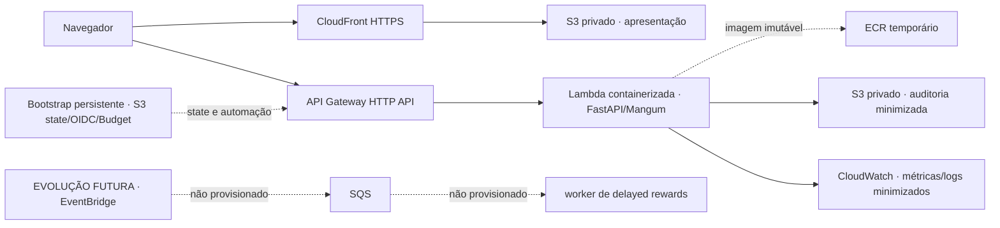

# Arquitetura cloud executada: AWS

**Status:** executada e validada no deploy histórico do #25; recursos temporários destruídos no #27. AWS é a única arquitetura cloud validada neste projeto. Azure aparece somente como equivalência conceitual; não houve implantação, smoke ou validação Azure e isto não é uma solução multicloud.

## Diagrama executável

O Mermaid abaixo é a fonte do diagrama usado no README e no apêndice do deck. O build offline da apresentação renderiza o diagrama sem CDN.

O caminho azul/contínuo foi efetivamente exercitado no AWS smoke: HTTPS do CloudFront, `/health`, CORS restrito à origem publicada, três cenários (`vehicle_simple`, `home_complex`, `guardrail_sensitive`) em `baseline` e `adaptive`, objetos S3 minimizados e telemetria sem payload. O bootstrap é separado do ciclo temporário e sobreviveu ao teardown.

A integração LocalStack reproduziu somente API Gateway REST → Lambda ZIP → S3. Ela é evidência de integração local, não prova de CloudFront, OIDC/IAM de conta, ECR/Lambda por imagem, CloudWatch ou paridade AWS. O caminho de Delayed Rewards (EventBridge/SQS/worker) é uma hipótese de evolução: não foi criado, não recebe eventos e não deve ser anunciado como capacidade atual.

## Equivalência Azure — somente conceitual

| Componente AWS validado | Equivalente Azure conceitual | Estado de validação |
| --- | --- | --- |
| CloudFront + S3 privado para apresentação | Front Door + Blob Storage privado | Não implantado nem validado |
| API Gateway HTTP + Lambda/FastAPI + ECR | API Management + Azure Functions/Container Registry | Não implantado nem validado |
| S3 de auditoria minimizada | Blob Storage com acesso privado | Não implantado nem validado |
| CloudWatch logs/métricas/alarmes | Azure Monitor + Application Insights | Não implantado nem validado |
| GitHub OIDC + IAM roles | Federated Identity Credentials + RBAC | Não implantado nem validado |
| EventBridge/SQS/worker **futuros** | Event Grid/Service Bus/worker **futuros** | Não provisionado em nenhuma nuvem |

A tabela é uma correspondência de responsabilidades, não um plano de implantação nem prova de portabilidade. Não há deployment Azure, conta Azure, configuração Azure ou operação multicloud neste repositório.

## Estado operacional

- URLs históricas do #25: CloudFront `https://d28gr8c30kxdfs.cloudfront.net` e API `https://487n63a3vd.execute-api.us-east-1.amazonaws.com/`. Ambas devem ser tratadas como **offline/destroyed**; não são endpoints atuais.
- Persistem somente bootstrap/state, OIDC/roles/boundary e Budget. Recursos temporários da demo (S3 apresentação/auditoria, ECR, Lambda, API Gateway, CloudFront/OAC e observabilidade) foram verificados ausentes.
- O Budget é alerta consultivo, não hard stop. O modo de quota baixa usado no #25 omitiu reserved concurrency enquanto a quota Lambda 10 e o pedido de aumento permaneciam pendentes.
- Ver evidências, hashes, commits, limitações e comandos em [`docs/demo/acceptance-final.md`](demo/acceptance-final.md) e operação em [`docs/demo/runbook-operador.md`](demo/runbook-operador.md).
